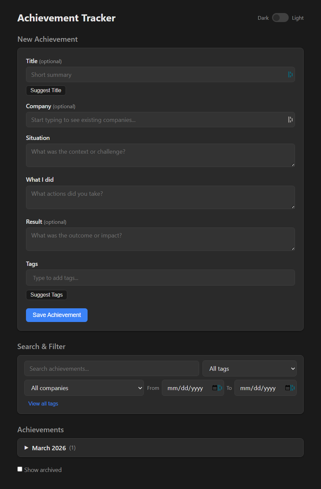

# Achievement Tracker

A lightweight, self-hosted web app for capturing day-to-day accomplishments, with LLM-powered tagging and title generation. Built for tracking wins that matter when it's time to update your resume or make the case for a promotion.

<p align="center">
  
</p>

## Quick Start

**Prerequisites:** Python 3.11+

```bash
# Install dependencies
pip install -e .

# Copy and configure environment variables (optional)
cp .env.example .env

# Launch the app
python launcher.py
```

The app opens in your browser automatically. No build step, no framework — just a fast, clean interface.

## Features

- **Structured entries** — capture Situation, Action, and Result for each achievement
- **AI-powered suggestions** — generate tags and titles from your entries using OpenAI
- **Tag system** — autocomplete from existing tags, view all tags with usage counts
- **Search and filter** — find achievements by keyword, tag, date range, or company
- **Monthly grouping** — collapsible months, each with individually collapsible achievement rows
- **Archive** — hide old entries without deleting them
- **Notion integration** — promote an achievement as a full STAR story to a Notion database, then sync updates back after edits
- **Light/dark mode** — toggle with persisted preference
- **Voice input ready** — works with dictation tools like WhisprFlow

## Optional Integrations

Both integrations are optional. The app works fully offline without them.

- **OpenAI** — powers the "Suggest Tags" and "Suggest Title" buttons (`gpt-4o-mini`)
- **Notion** — promotes achievements to a Notion database in STAR format with screenshot support

See [SETUP.md](SETUP.md) for detailed configuration instructions, including how to create the Notion database.

## Tech Stack

- **Backend:** Python, FastAPI, SQLite
- **Frontend:** Vanilla JS, CSS custom properties
- **AI:** OpenAI API (optional)
- **Storage:** Local SQLite database — your data stays on your machine
