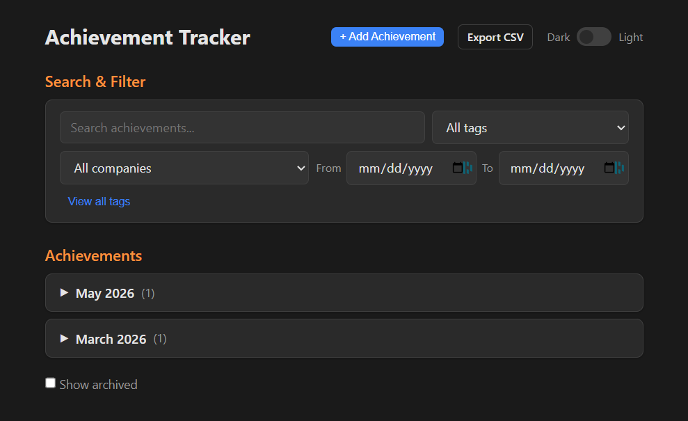
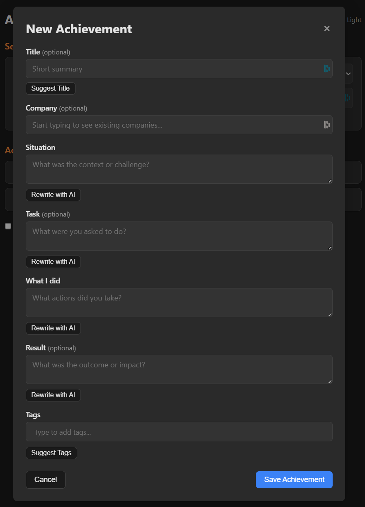

# Achievement Tracker

A lightweight, self-hosted web app for capturing day-to-day accomplishments in STAR format, with AI-powered writing assistance. Built for tracking wins that matter when it's time to update your resume or make the case for a promotion.

<p align="center">
  
</p>
<p align="center">
  
</p>

## Quick Start

**Prerequisites:** Python 3.11+

```bash
# Install dependencies
pip install -e .

# Copy and configure environment variables (optional)
cp .env.example .env

# Launch the app
python launcher.py
```

The app opens in your browser automatically. No build step, no framework — just a fast, clean interface.

## Features

- **Full STAR entries** — capture Situation, Task, Action, and Result for each achievement
- **AI writing assistance** — suggest tags and titles, or rewrite any field to clean up dictated or rough text (with one-click revert)
- **Tag system** — autocomplete from existing tags, view all tags with usage counts
- **Search and filter** — find achievements by keyword, tag, date range, or company
- **Monthly grouping** — collapsible months, each with individually collapsible achievement rows
- **Archive** — hide old entries without deleting them
- **Notion integration** — promote an achievement as a full STAR story to a Notion database, then sync updates back after edits
- **CSV export** — download all achievements as a CSV for backup or further analysis
- **Light/dark mode** — toggle with persisted preference
- **Voice input ready** — works with dictation tools like WhisprFlow; use AI rewrite to clean up after dictating

## Optional Integrations

Both integrations are optional. The app works fully offline without them.

- **OpenAI** — powers "Suggest Tags", "Suggest Title", and "Rewrite with AI" (`gpt-4o-mini`)
- **Notion** — promotes achievements to a Notion database in STAR format with screenshot support

See [SETUP.md](SETUP.md) for detailed configuration instructions, including how to create the Notion database.

## Tech Stack

- **Backend:** Python, FastAPI, SQLite
- **Frontend:** Vanilla JS, CSS custom properties
- **AI:** OpenAI API (optional)
- **Storage:** Local SQLite database — your data stays on your machine
